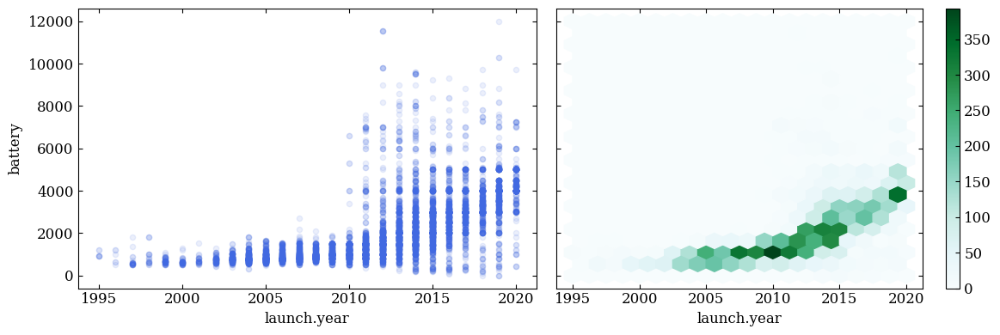
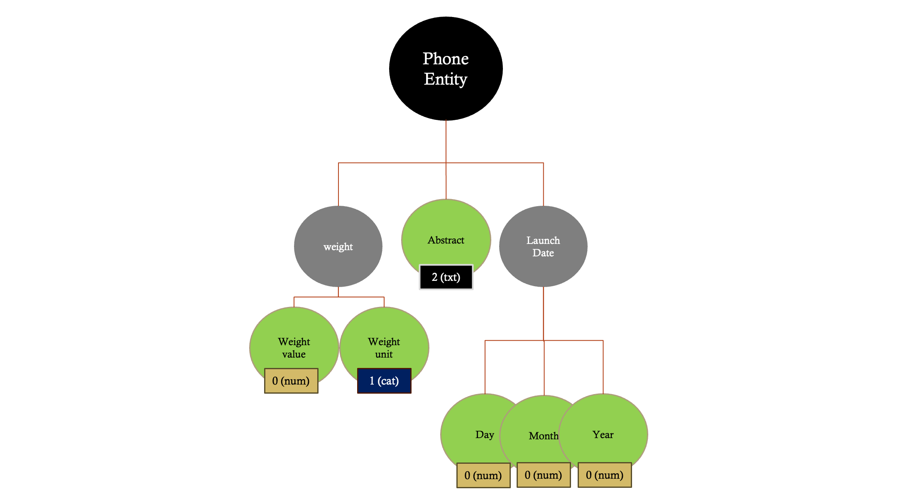
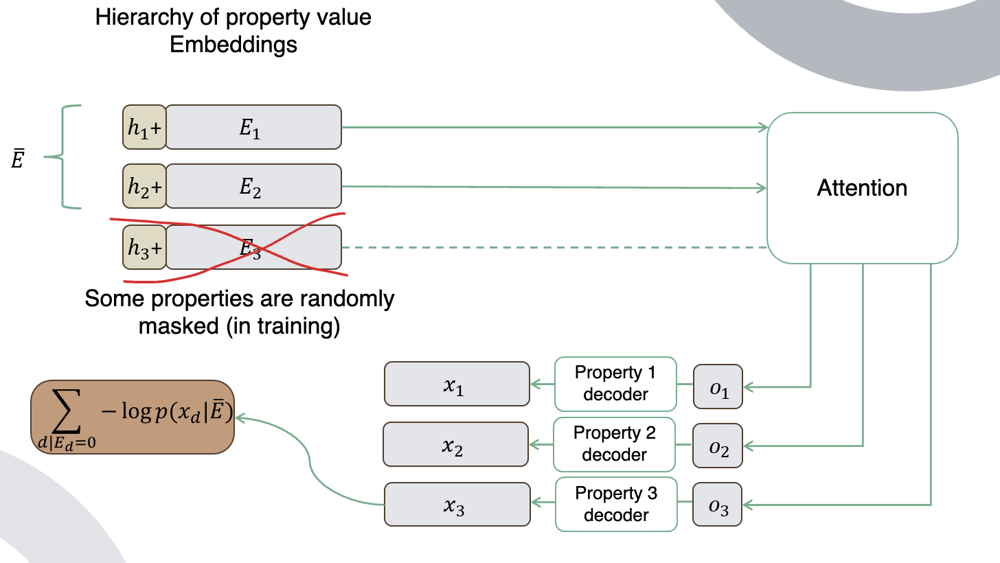

# kb-generator

Disclaimer: This is very much a work in progress. The code may not be well documented or well tested. Please use at your own risk.
## Table of Contents
- [Introduction](#introduction)
- [Getting started](#getting-started)
- [Overview](#overview)
- [Key Features](#key-features)
- [Repository Structure](#repository-structure)
- [Usage](#usage)

## Getting started
- First things first, clone this repository. Then, install the requirements using the following command:
```pip install -r requirements.txt```
you might also need to install `transformers` to use huggingface's pretrained models.
- You should also install the package using
```pip install -e .```
before you start using the code.
- set KBGEN_LOGDIR in your environment to where data will be downloaded and models and logs will be saved.
- Take a quick look at `nbs/exploration_gsm.ipynb` to get a feel for the dataset and the preprocessing steps (as well as figure out how to download the data!). I'm not sure if there's a way to get around the Kaggle API but you can install the python package (in the requirements) then run `kaggle datasets download -d msainani/gsmarena-mobile-devices`" Then unzip the file and place it in the data folder (which should be `os.path.join(rootdir, "/data/gsm")`) using `unzip gsmarena-mobile-devices.zip gsm.csv`.

Then, run the following command to train the model:
``python train.py``

TODO: Write a script to automate the setup process.

## Introduction
This repository contains the implementation of a prototype for a KB-generative model. The primary goal of the project is to create a joint model for properties in a Knowledge Base (KB) by performing masked modeling on subsets of a large KB like WikiData.

## Overview
The project has three main components:

- Developing a non-autoregressive loss function for joint modeling of hetergoneous properties.
- Developing a general prescription for encoding heterogenous types.
- Developing an architecture that can model the joint distribution over properties well.


The grand purpose of this project is to develop a human-readable, differentiable database for LLMs or other planning models, which would have significant interpretability and safety ramifications.

## Key Features
Improved entity linking using similarity metrics on learned embeddings of entities
Ability to ask "what-if?" questions where the model fills in the blanks for things like product details prompted with only basic descriptions
## Repository Structure
Files you may care about:
```
train.py
exploration_gsm.ipynb
kbgen/
  ├── diffusion.py
  └── model/
        └── model.py
        └── positional_encodings.py
  └── data/
        └── datasets.py
```

`exploration_gsm.ipynb`
This file contains some exploration and preprocessing of the Kaggle GSM dataset which can be downloaded using the following command:
```kaggle datasets download -d msainani/gsmarena-mobile-devices```
Here's a sample plot from the dataset:


`positional_encodings.py`
This file implements the positional encodings for the KBGEN model using hierarchical tree structures. The idea is that the positional encoding of a node in the tree is determined by the path from the root to the node.

`train.py`
This file contains code for training and evaluating our KBGenerator model. It includes data preprocessing, tokenization, and training loop with loss calculation and optimization steps. Run ```python train.py --help``` for a list of the available command line arguments. All defaults are at the top of the file.
Reads a csv dataset along with it's schema in json format. The schema is a hierarchical dict of dicts where keys are either column names and values are other dicts or the column type for leaf nodes
The basic types are defnied as follows:
- 0 : Numerical
- 1 : Categorical
- 2 : Text

Here's a **schema example**
```
"phone": {
  "name" : {"model" : 1, "brand" : 1},
  "weight" : {"value" : 0, "unit" : 1},
  "launch_date" : {"year" : 0, "month" : 0, "day" : 0},
  "abstract" : 2,
}
```



`model.py`
This file defines our main KBGenerator class its (submodules are defined in `modules.py`), which are used to build our final generative model.

### How are missing values handled?
Well, since we are doing masked modeling, we can simply mask out the missing values and train the model to predict them! This is **THE** advantage of our model over other models that require complete data.
First, think about the problem of modeling an entity from a subset of its properties as a translation task using an Encoder/Decoder Transformer. We want to translate from a bag of properties to another (bigger) bag of properties.


Let's look at some pseudo-code:

Suppose we have an `entity_dict` that contains all the values of properties of an entity.
- `encode_structure(schema)` is a function that returns positional encodings aware of the tree structure of the schema. The positional encodings tell the model what property it's dealing with.
- `entity_encoder(entity_dict)` is a function over a bag of properties it doesn't care about their order or how many there are. It returns the encoded representation of the entity. This is the encoder output in the translation task.
- `entity_decoder(target, encoded_entity)` is a function that takes the encoded representation of an entity and decodes it into a target bag of properties. This is the decoder output in the translation task. `target`, in this case, is simply a bag of positional encodings for the properties we want to predict.

(N.b., note that the above encoder/decoder setup can be replaced by an encoder-only setup where we simply predict the missing properties from the encoded representation of the entity. This is what is done in the latest version of the model. This approach trades of the flexibility to decode only a subset of the properties for simplicity and speed.)

Here's a diagram of the the architecture:



Now, let's look at the entity_dict for an instance of the phone entity given by the schema above:
```
entity_dict = {"phone.name.model": "iPhone 12",
"phone.name.brand": "Apple",
"phone.weight.value": 164,
"phone.weight.unit": "g",
<!-- "phone.launch_date.year": 2020,  --> Suppose this line does not exist.
"phone.launch_date.month": 10,
"phone.launch_date.day": 13,
"phone.abstract": "The iPhone 12 is a line of smartphones designed, developed, and marketed by Apple Inc. They were announced on October 13, 2020, alongside the iPhone 12 Mini and iPhone 12 Pro Max at the Steve Jobs Theater at Apple Park in Cupertino, California by Apple CEO Tim Cook, with pre-orders beginning on October 16, 2020, and shipments beginning on October 23, 2020."}

```
Now let's suppose the launch year is missing from the `entity_dict`. We can pass the rest of the dict to our model and ask it to reconstruct the whole entity, including the launch year:

```
encoder_output = entity_encoder(entity_dict, schema)
target_positional_encodings = encode_structure(schema)
decoder_output = entity_decoder(target_positional_encodings, encoder_output)
```
The decoder output will be a dict with the launch year filled in.

## Usage
To train and evaluate our KBGenerator model, simply run train.py. This script will load (some) dataset, preprocess it, tokenize it using custom tokenizer functions, initialize our KBGenerator model with given configuration parameters and train it using provided training loop.


## Contributing

This project welcomes contributions and suggestions.  Most contributions require you to agree to a
Contributor License Agreement (CLA) declaring that you have the right to, and actually do, grant us
the rights to use your contribution. For details, visit https://cla.opensource.microsoft.com.

When you submit a pull request, a CLA bot will automatically determine whether you need to provide
a CLA and decorate the PR appropriately (e.g., status check, comment). Simply follow the instructions
provided by the bot. You will only need to do this once across all repos using our CLA.

This project has adopted the [Microsoft Open Source Code of Conduct](https://opensource.microsoft.com/codeofconduct/).
For more information see the [Code of Conduct FAQ](https://opensource.microsoft.com/codeofconduct/faq/) or
contact [opencode@microsoft.com](mailto:opencode@microsoft.com) with any additional questions or comments.

## Trademarks

This project may contain trademarks or logos for projects, products, or services. Authorized use of Microsoft
trademarks or logos is subject to and must follow
[Microsoft's Trademark & Brand Guidelines](https://www.microsoft.com/en-us/legal/intellectualproperty/trademarks/usage/general).
Use of Microsoft trademarks or logos in modified versions of this project must not cause confusion or imply Microsoft sponsorship.
Any use of third-party trademarks or logos are subject to those third-party's policies.
